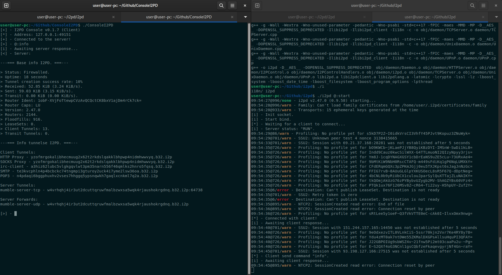
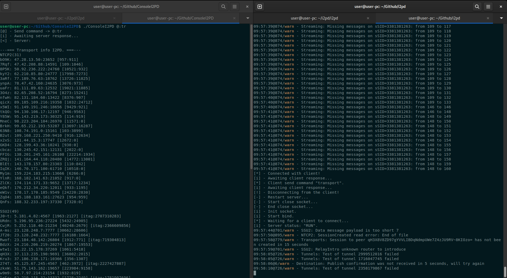
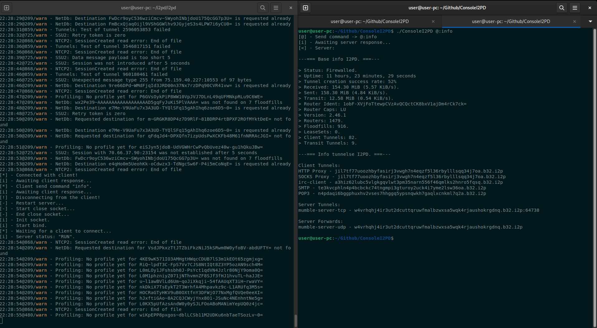

<h1 align="center">Hi there, I`m,
	<a href="https://notabug.org/Nick_Kramer" target="_blank">
	Nick Kramer.
	</a> 
</h1>

<h3 align="center"> Porject: ConsoleI2PD. </h3>

	*Description: A simple TCP client, for connecting to a local I2PD router TCP server..

`LICENCIA` = **GPLv3**.

### How to build it all up?

Start by cloning the repository.
    $ git clone https://github.com/nick-kramer117/ConsoleI2PD.git
    
Run the make command (in the repository directory).
    $ make
    
### (Server) How do you get it up and running?

Running an I2PD router with a TCP server.
    $ ./i2pd @:start

### (Client) How do you get it up and running?

Startup description (simple):
    $ ./Consolei2pd

Startup description (One-time launch):
    $ ./Consolei2pd @:<cmd> 

< cmd > - Server command. 
@:? - Search for server commands.
-h - Call helper.

### IMPORTANT: If you are running an I2PD router with a TCP server, it is only possible to stop the I2PD router using the TCP client command: < @:stop > !!!

### Command info: Server.

* @:info - Output base info about i2pd router.
* @:tr - Output info transport i2pd.
* @:exit - close console i2pd client.
* @:stop - kill i2pd service and exit.

### Owerview "ConsoleI2PD."

Simple start client.
 

Single client run with command: < @:tr >
 

Single client startup after ~10 hours of I2PD router operation, using the command: < @:info >
 

